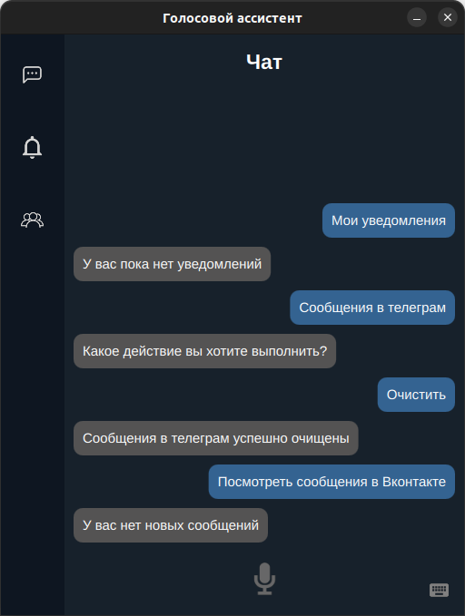

# voice-assistant

Voice assistant, for automating the processes of everyday life

![Python][python-version]

---
## Opportunities
* Monitoring of new messages in:
	- Telegram
	- VK
* Notification of new messages received in the previous paragraph


---
## Requirements
* Python 3.10+
* Linux, Windows or macOS

---
## Installation

### Installing
```
git clone https://github.com/b0shka/voice-assistant.git
cd voice-assistant
```

### To install the necessary libraries
#### Installing on Linux or Mac
```
pip3 install -r requirements.txt
```

#### Installing on Windows
```
pip install -r requirements.txt
```

---
## Configure
To work, you must create a `.env` file in the main directory of the project and specify such variables as:
```
VK_TOKEN - developer token for access to the vkontakte api
TELEGRAM_USER_ID - your telegram account id
TELEGRAM_API_ID - api id of your application created on the site my.telegram.org
TELEGRAM_API_HASH - api hash of your application created on the site my.telegram.org
PATH_FILE_DB - the path to the folder where the local assistant database will be created
PATH_FILE_SESSION_TELEGRAM - the path to the .session file that will be used to access your telegram account
YANDEX_CLOUD_API_KEY - yandex cloud developer api key, for working with speech synthesis and recognition
```


---
## Usage
```
cd src/
```
#### Usage on Linux or Mac
```
python3 ./main.py
```

#### Usage on Windows
```
python ./main.py
```

### View of the main application window


---
## Additionally
The `scripts/` directory contains additional scripts for configuring the asset
* `get_telegram_session_file.py` - script for getting the .session file, but before it is launched, you need to fill in the variables:
	- API_ID - api id of your application created on the site my.telegram.org
	- API_HASH - api hash of your application created on the site my.telegram.org
	- NAME_SESSION - name for the one being created .session file
* `get_telegram_user_id.py` - the script to get your account id in the telegram, but before it is launched, you need to fill in the variables:
	- API_ID - api id of your application created on the site my.telegram.org
	- API_HASH - api hash of your application created on the site my.telegram.org
	- NAME_SESSION - path to the .session file


[python-version]: https://img.shields.io/static/v1?label=Python&message=v3.10&color=blue